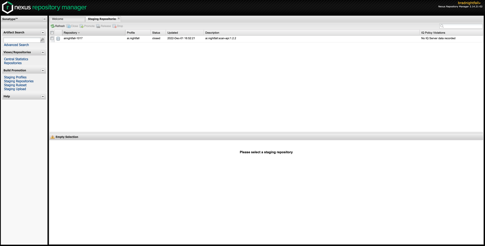

# Nightfall Java SDK

**Embed Nightfall scanning and detection functionality into Java applications**

<!-- TODO add badges [](https://travis-ci.org/joemccann/dillinger)
-->

##  Features

This SDK provides Java bindings for the Nightfall API. It allows you to add functionality to your applications to
scan plain text and files in order to detect different categories of information. You can leverage any of
the detectors in Nightfall's pre-built library, or you may programmatically define your own custom detectors. 

Additionally, this library provides convenience features such as encapsulating the steps to chunk and upload files.

To obtain an API Key, login to the [Nightfall dashboard](https://app.nightfall.ai/) and click the section
titled "Manage API Keys".

See our [developer documentation](https://docs.nightfall.ai/docs/entities-and-terms-to-know) for more details about
integrating with the Nightfall API.

## Dependencies

The Nightfall Java SDK requires Java 8 or later.

For a full list of external dependencies please consult `pom.xml`.

## Installation

### Maven
Add the following to your project's `pom.xml`:

``` xml
<dependency>
    <groupId>ai.nightfall</groupId>
    <artifactId>scan-api</artifactId>
    <version>1.0.0</version>
</dependency>
```

### Gradle
Add the following to your project's `dependencies`:

```
implementation group: 'ai.nightfall', name: 'scan-api', version: '1.0.0'
```

### Building Locally

Alternatively, if you would like to build the project yourself:
1. Clone this git repository
2. Run `mvn package` from the top-level directory.
3. The `build` directory should contain two artifacts: `api-$VERSION.jar` and `api-$VERSION-shaded.jar`. The former
contains *only* the compiled source files of this project, whereas the latter includes the compiled dependencies. 
4. Take whichever jar you prefer from the `build/` directory and add it to your project's classpath.

## Usage

### Scanning Plain Text

Nightfall provides pre-built detector types, covering data types ranging from PII to PHI to credentials. The following
snippet shows an example of how to scan using pre-built detectors.

####  Sample Code

To run the [the TextScannerExample class](src/main/java/ai/nightfall/examples/TextScannerExample.java),

first compile:
```bash
make jar
```

and then set your API key as an environment variable and run the sample program (changing version number in the jar if necessary):

```bash
export NIGHTFALL_API_KEY="NF-XXXXXX" # replace with your API key
java -cp build/scan-api-1.2.2.jar ai.nightfall.examples.FileScannerExample /path/to/file
```


### Scanning Files

Scanning common file types like PDF's or office documents typically requires cumbersome text
extraction methods like OCR.

Rather than implementing this functionality yourself, the Nightfall API allows you to upload the
original files, and then we'll handle the heavy lifting.

The file upload process is implemented as a series of requests to upload the file in chunks. The library
provides a single method that wraps the steps required to upload your file. Please refer to the
[API Reference](https://docs.nightfall.ai/reference) for more details.

The file is uploaded synchronously, but as files can be arbitrarily large, the scan itself is conducted asynchronously.
The results from the scan are delivered by webhook; for more information about setting up a webhook server, refer to
[the webhook server docs](https://docs.nightfall.ai/docs/creating-a-webhook-server).

#### Sample Code

To run the [the FileScannerExample class](src/main/java/ai/nightfall/examples/FileScannerExample.java), first start a [webhook server](https://docs.nightfall.ai/docs/creating-a-webhook-server) to which results will be delivered. [ngrok](https://ngrok.com/) is a good way to expose a locally running webhook service on a publically-reachable URL:
```bash
# ngrok creates a public webhook URL that tunnels to your local machine. Change the port if you're not listening on port 8075.
ngrok http 8075
# copy the HTTPS URL ngrok displays, for example https://myurl.ngrok.io
# supposing you're running a Python webhook server
python webhook.py
```

Compile the SDK and example code:
```bash
make jar
```

then set your API key as an environment variable and run the sample program (changing version number in the jar if necessary):

```bash
export NIGHTFALL_API_KEY="NF-XXXXXX" # replace with your API key
NGROK_URL="myurl" # replace with the URL from running ngrok above
java -cp build/scan-api-1.2.2.jar ai.nightfall.examples.FileScannerExample "$NGROK_URL" /path/to/file
```


## Contributing

Contributions are welcome! Open a pull request to fix a bug, or open an issue to discuss a new feature
or change. Please adhere to the linting criteria defined in `checkstyle.xml`, and be sure to add unit
tests for any new functionality you add.

Refer to `CONTRIBUTING.md` for the full details.

## Publishing new version

Most of this process is automated but there are some final manual steps to release the new version
1. Create a commit to update all the version numbers in this repo (`pom.xml`, `README`, `Makefile`)
2. Once the commit is in `main` create a new tag `v*.*.*` (same version in the commit made). The tag will trigger a Github Action to build and push to the [Nexus Repository Manager](https://s01.oss.sonatype.org/#view-repositories)
3. Once the job has successfully ran you can go to `Staging Repositories` in the Nexus Repository Manager and you should see a new version

4. The staged version can be inspected in browser to ensure it is correct
5. The staged version can be selected to take action on it `Drop` or `Release`

## License

This code is licensed under the terms of the MIT License. See [here](https://opensource.org/licenses/MIT)
for more information.

Java is licensed by Oracle. See [here](https://www.oracle.com/java/technologies/javase/jdk-faqs.html)
for more information.
